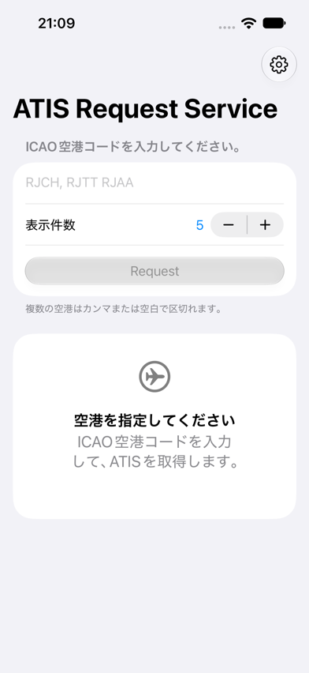
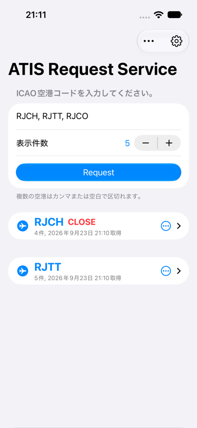
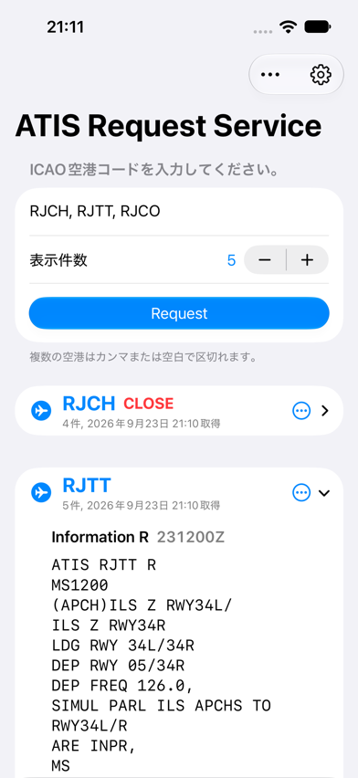

# SWIMATIS

SWIM Web API から複数空港の ATIS を取得し、発行日時順に表示する SwiftUI アプリです。

A SwiftUI app that retrieves ATIS for multiple airports from the SWIM Web API and displays reports in latest.

> [!WARNING]
> 業務利用を前提としたアプリであり、一般向けの航空情報閲覧サービスではありません。<br>
> This app targets professional aviation use and is not a public aviation information service.


[日本語](#日本語) ・ [English](#english)

## スクリーンショット / Screenshots

| 初期画面 / Empty state | 結果一覧 / Results overview |
|---|---|
|  |  |
| RJCH（CLOSE・発行日時） / RJCH (CLOSE and issue time) | RJTT（展開表示） / RJTT (expanded) |
|  |  |

> スクリーンショットでは、入力した3空港のうち `RJCO` は撮影時点のSWIM ATIS提供対象外であるため、結果に表示されていません。対象空港はサービス側で変更される可能性があるため、アプリ内に固定リストは持たず、SWIMの応答に従います。対象空港については、SWIMのドキュメントを参照してください。
>
> Of the three airports entered in the screenshot, `RJCO` does not appear in the results because it was outside the SWIM ATIS service coverage at the time of capture. Because service coverage may change, the app does not maintain a fixed allowlist and instead follows the SWIM response. See SWIM for details.


## 日本語

### 概要

SWIMETAR は、指定した ICAO 空港コードの ATIS（Automatic Terminal Information Service）を SWIM Web API から取得し、空港ごとに整理して表示する SwiftUI アプリケーションです。SWIM Web API の利用資格を持つ利用者が、必要な ATIS を短時間で確認できるようにすることを目的としています。

認証情報は端末の Keychain にのみ保存され、認証とATIS取得のためにSWIMのエンドポイントへ送信されます。

### 必要条件

- Xcode 26.3 以降
- iOS / iPadOS 27.0 以降、または macOS 27.0 以降
- 有効な SWIM Web API 認証情報（登録メールアドレスとパスワード）
- 利用に必要な権限および適用される利用条件への適合

### 機能

- ICAO 空港コードを複数指定して ATIS を取得（4 文字の英字のみを有効なコードとして扱い、重複は自動的に除外）
- 1 空港あたりの取得件数を 1〜50 件の範囲で指定（初期値 5 件）
- 空港ごとにセクション分けし、本文の発行日時（`DDHHMMZ`）を基準に新しい ATIS から順に表示
- ATIS 本文から Information 記号と発行日時を抽出して見出しに表示
- `ATIS <ICAOコード>` / `CLOSE` の応答は本文を省略し、空港見出しに `CLOSE` と表示
- 空港単位でのレポートの共有（コピーと印刷は iOS / iPadOS のみ）
- 取得結果の再取得・一括クリア
- 外観（システム設定 / ライト / ダーク）の切り替え
- 認証情報を Keychain に保存し、次回起動時に自動で再利用（初回ロック解除後・この端末のみ）
- SWIM のエラーコードを日本語のメッセージに変換して表示

### 使い方

1. 初回起動時のセットアップ画面で、SWIM API の登録メールアドレスとパスワードを入力して保存します。
2. 入力欄に ICAO 空港コードを入力します。カンマ（`,`）とスペースで区切って複数指定できます。
3. ステッパーで 1 空港あたりの表示件数（1〜50）を調整します。
4. `Request` をタップして ATIS を取得します。
5. 空港セクション右側のメニューから、その空港のレポートを共有（iOS / iPadOS ではコピー・印刷も）できます。
6. ツールバーのメニューから、結果の再取得・クリア、外観の変更、認証情報の更新ができます。

存在しない空港コードや ATIS が無い空港は、エラーにせずスキップされます。すべての空港で結果が得られない場合は、その旨が画面に表示されます。運用休止を示す `CLOSE` 応答は、空港コードの横に状態として表示されます。

### 対応プラットフォーム

- iOS / iPadOS（iPhone・iPad）
- macOS（Mac Catalyst は未対応）

### はじめ方

1. リポジトリをクローンします。
   ```bash
   git clone https://github.com/halka/SWIMETAR.git
   cd SWIMETAR
   ```
2. Xcode で `SWIM METAR.xcodeproj` を開きます。
3. シミュレータまたは実機でビルドして実行します。
4. 起動時の認証画面で SWIM API の認証情報を入力します。
5. `RJTT`、`RJAA`、`RJCH` などの ICAO 空港コードを入力し、ATIS を取得します。

### 動作の概要

- ログイン API（`/swim/webapi/login`）で認証し、取得した `MSMSI` / `MSMAI` セッション Cookie を ATIS 取得リクエストに付与します。
- ATIS は空港ごとに 1 リクエストずつ取得し、`error_info` のコードに応じて結果の採用・スキップ・エラー表示を切り替えます。
- 本文の `DDHHMMZ` をUTCの発行日時として解釈し、月またぎを考慮して新しい順に並べます。日時を解釈できないデータは末尾に表示します。
- セッションは毎回の取得時に取り直し、`URLSession` は ephemeral 構成のため Cookie は端末に永続化されません。
- HTML が返された場合や想定外の JSON 構造の場合は、認証切れ、または応答形式の不一致として扱います。

### SWIM について

SWIM（System Wide Information Management）は、国土交通省航空局が管理する航空情報の共有基盤です。空港運航情報、気象情報、飛行情報など、航空関係者が業務上必要とする情報が共有されます。

## English

### Overview

SWIMETAR is a SwiftUI application that retrieves ATIS (Automatic Terminal Information Service) reports from the SWIM Web API for the ICAO airport codes you specify and presents them grouped by airport. It is intended for users who hold valid SWIM Web API access and need quick operational access to ATIS data.

Credentials are stored only in the device Keychain and are sent to the SWIM endpoints solely for authentication and ATIS retrieval.

### Requirements

- Xcode 26.3 or later
- iOS / iPadOS 27.0 or later, or macOS 27.0 or later
- Valid SWIM Web API credentials (registered email address and password)
- Appropriate authorization and compliance with the applicable usage conditions

### Features

- Request ATIS for multiple ICAO airport codes at once (only four-letter alphabetic codes are accepted; duplicates are removed automatically)
- Choose how many reports to retrieve per airport, from 1 to 50 (default 5)
- Group results into per-airport sections and sort them newest first using the `DDHHMMZ` issue time in each report
- Extract the information code and issue time from each report and show both in the row heading
- Suppress `ATIS <ICAO code>` / `CLOSE` response bodies and show `CLOSE` beside the airport code instead
- Share a per-airport report (copy and print are available on iOS / iPadOS only)
- Re-run the last request or clear all results
- Switch appearance between system, light, and dark
- Persist credentials in the Keychain for reuse on next launch (after first unlock, this device only)
- Translate SWIM service error codes into readable messages

### Usage

1. On first launch, enter and save your SWIM API email address and password in the setup screen.
2. Enter ICAO airport codes in the text field. Separate multiple codes with commas (`,`) or spaces.
3. Use the stepper to set the number of reports per airport (1–50).
4. Tap `Request` to retrieve ATIS data.
5. Use the menu on the right of each airport section to share that airport's report (copy and print are also available on iOS / iPadOS).
6. Use the toolbar menus to refresh or clear results, change the appearance, or update stored credentials.

Unknown airport codes and airports without ATIS data are skipped rather than treated as failures. If no airport returns data, the app shows an empty-state message instead. A `CLOSE` response is represented as a status beside the airport code.

### Supported Platforms

- iOS / iPadOS (iPhone and iPad)
- macOS (Mac Catalyst is not supported)

### Getting Started

1. Clone the repository:
   ```bash
   git clone https://github.com/halka/SWIMETAR.git
   cd SWIMETAR
   ```
2. Open `SWIM METAR.xcodeproj` in Xcode.
3. Build and run the app on a simulator or device.
4. Enter your SWIM API email and password when prompted.
5. Add ICAO airport codes such as `RJTT`, `RJAA`, or `RJCH` and retrieve ATIS information.

### How It Works

- The app authenticates against the login API (`/swim/webapi/login`) and attaches the returned `MSMSI` / `MSMAI` session cookies to the ATIS request.
- ATIS data is requested one airport at a time, and the `error_info` code determines whether a result is used, skipped, or surfaced as an error.
- The app interprets `DDHHMMZ` as a UTC issue time, accounts for month boundaries, and sorts reports newest first. Reports whose time cannot be parsed appear last.
- A fresh session is established for every fetch, and the ephemeral `URLSession` configuration means cookies are never persisted on the device.
- HTML responses or unexpected JSON structures are reported as an expired session or a payload mismatch.

### About SWIM

SWIM (System Wide Information Management) is an information-sharing framework for aviation data managed by the Civil Aviation Bureau of the Ministry of Land, Infrastructure, Transport and Tourism. It supports the distribution of operational, meteorological, and flight-related information needed by aviation stakeholders in the course of their work.

## 関連プロジェクト / Related Project

- [SWIM WebAPI ATIS Client](https://github.com/halka/SWIM-WebAPI-ATIS-Client/) — 国土交通省航空局SWIMのATIS Information Request Service（`FLV402001`）を利用するTypeScriptクライアント。A TypeScript client for the Japanese MLIT SWIM ATIS Information Request Service.

## Project Structure

- `SWIM METAR/MyApp.swift` — app entry point
- `SWIM METAR/ContentView.swift` — app state model and SwiftUI views
- `SWIM METAR/ATISClient.swift` — SWIM authentication and ATIS requests
- `SWIM METAR/ATISModels.swift` — response models, ATIS parsing, and error definitions
- `SWIM METAR/KeychainStore.swift` — Keychain-backed credential storage
- `SWIM METAR/Assets.xcassets/` — app icon and color assets
- `SWIM METAR.xcodeproj/` — Xcode project files
- `LICENSE` — MIT license

## License

This project is licensed under the MIT License. See the [LICENSE](LICENSE) file for details.
