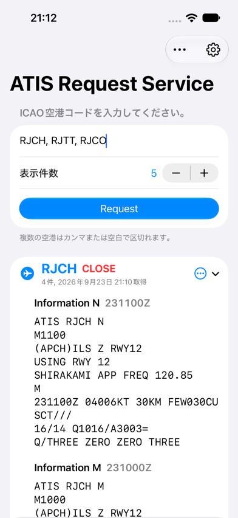

# SWIMATIS

SWIM Web API から複数空港の ATIS を取得し、空港ごとの表示・共有・ファイル書き出しができる SwiftUI アプリです。

A SwiftUI app for retrieving, viewing, sharing, and exporting ATIS reports for multiple airports through the SWIM Web API.

> [!WARNING]
> 業務利用を前提としたアプリであり、一般向けの航空情報閲覧サービスではありません。<br>
> This app targets professional aviation use and is not a public aviation information service.

[日本語](#日本語) ・ [English](#english)

## スクリーンショット / Screenshots

| 初期画面 / Empty state | 結果一覧 / Results overview |
|---|---|
|  |  |
| RJCH（CLOSE・発行日時） / RJCH (CLOSE and issue time) | RJTT（展開表示） / RJTT (expanded) |
|  |  |

> スクリーンショットは撮影時点の UI と取得結果です。アプリ内に対象空港の固定リストは持たず、SWIM の応答に従って結果を表示します。
>
> Screenshots show the UI and results at the time of capture. The app follows the SWIM response and does not maintain a fixed list of supported airports.

## 日本語

### 概要

SWIMATIS は、指定した ICAO 空港コードの ATIS（Automatic Terminal Information Service）を SWIM Web API から取得し、空港ごとに整理して表示する SwiftUI アプリケーションです。SWIM Web API の利用資格を持つ利用者が、必要な ATIS を短時間で確認できるようにすることを目的としています。

認証情報は端末の Keychain に保存され、SWIM のログイン API で使用されます。ATIS の取得には、ログインで得たセッション Cookie を使用します。

### 必要条件

- Xcode 27.0 以降（対象プラットフォームの 27.0 SDK を含む）
- iOS / iPadOS 27.0 以降、または macOS 27.0 以降
- 有効な SWIM Web API 認証情報（登録メールアドレスとパスワード）
- 利用に必要な権限および適用される利用条件への適合

### 機能

- ICAO 空港コードを複数指定して ATIS を取得（入力を大文字化し、4 文字のコードのみ採用。数字・記号を含む入力と重複は除外）
- 1 空港あたりの取得件数を 1〜50 件の範囲で指定（初期値 5 件）
- 空港ごとの折りたたみ可能なセクションに、SWIM の応答順で ATIS 本文を表示
- 各空港の先頭レポートから Information 記号と発行日時（`DDHHMMZ`）を抽出して空港見出しに表示
- レポート単位・空港単位・全取得結果の共有と TXT / CSV 書き出し
- PDF 書き出し、コピー、印刷（iOS / iPadOS のみ）
- 現在の入力条件での再取得・確認ダイアログ付きの一括クリア
- 外観（システム設定 / ライト / ダーク）の切り替え
- 認証情報を Keychain に保存し、次回起動時に自動で再利用（初回ロック解除後・この端末のみ）
- SWIM のエラーコードを日本語のメッセージに変換して表示

### 使い方

1. 初回起動時のセットアップ画面で、SWIM API の登録メールアドレスとパスワードを入力して保存します。
2. 入力欄に ICAO 空港コードを入力します。カンマ（`,`）とスペースで区切って複数指定できます（例：`RJTT, RJAA, RJCH`）。
3. ステッパーで 1 空港あたりの表示件数（1〜50）を調整します。
4. `ATISを取得` をタップして ATIS を取得します。
5. 空港見出しで本文を開閉できます。各レポート・空港見出しの共有メニュー、またはツールバーの `すべて共有` から、共有や `ファイル共有`（TXT / CSV、iOS / iPadOS では PDF も）を選びます。
6. ツールバーのメニューから、結果の再取得・クリア、外観の変更、認証情報の更新ができます。

存在しない空港コードや ATIS が無い空港は、SWIM がエラーコード `4` または `1` を返した場合にスキップされます。すべての空港で結果が得られない場合は、その旨が画面に表示されます。それ以外の取得エラーでは、表示中の結果をクリアしてエラーを表示します。

現在の実装では、先頭レポートに `DDHHMMZ` 形式の発行日時が見つからない場合、空港見出しに `CLOSE` と表示します。`CLOSE` 応答も含め、レポート本文はそのまま表示します。

### プロジェクトの対象プラットフォーム

- iOS / iPadOS（iPhone・iPad）
- macOS（Mac Catalyst は未対応）

### はじめ方

1. リポジトリをクローンします。

   ```bash
   git clone https://github.com/halka/SWIMATIS.git
   cd SWIMATIS
   ```
2. Xcode で `SWIMATIS.xcodeproj` を開きます。
3. `SWIMATIS` スキームを選び、iPhone / iPad シミュレータ、実機、または `My Mac` を実行先に指定します。実機で実行する場合は、`Signing & Capabilities` で自分の開発チームと必要に応じて Bundle Identifier を設定します。
4. macOS で SWIM に接続する場合は、`Signing & Capabilities` → `App Sandbox` の `Outgoing Connections (Client)` を有効にします。現在のプロジェクトでは `ENABLE_OUTGOING_NETWORK_CONNECTIONS = NO` に設定されています。
5. ビルドして実行し、起動時の認証画面で SWIM API の認証情報を入力します。
6. `RJTT`、`RJAA`、`RJCH` などの ICAO 空港コードを入力し、ATIS を取得します。

外部パッケージへの依存はなく、パッケージマネージャーでの追加セットアップは不要です。

### 動作の概要

- ログイン API（`/swim/webapi/login`）で認証し、取得した `MSMSI` / `MSMAI` セッション Cookie を ATIS Information Request Service（`/f2atrq/web/FLV402001`）のリクエストに付与します。
- 入力した空港を順番に処理し、空港ごとに認証と ATIS 取得を行います。`error_info` のコードに応じて結果の採用・スキップ・エラー表示を切り替えます。
- 空港は入力順に、各空港のレポートは SWIM の応答順に表示します。発行日時による並べ替えは行っていません。
- 空港ごとの取得に ephemeral 構成の `URLSession` を使用し、セッション Cookie は端末に永続化しません。
- HTML が返された場合や想定外の JSON 構造の場合は、認証切れ、または応答形式の不一致として扱います。

### SWIM について

SWIM（System Wide Information Management）は、国土交通省航空局が管理する航空情報の共有基盤です。空港運航情報、気象情報、飛行情報など、航空関係者が業務上必要とする情報が共有されます。

## English

### Overview

SWIMATIS is a SwiftUI application that retrieves ATIS (Automatic Terminal Information Service) reports from the SWIM Web API for the ICAO airport codes you specify and presents them grouped by airport. It is intended for users who hold valid SWIM Web API access and need quick operational access to ATIS data.

Credentials are saved in the device Keychain and used with the SWIM login API. ATIS requests use the session cookies returned by that login.

### Requirements

- Xcode 27.0 or later, including the 27.0 SDK for the target platform
- iOS / iPadOS 27.0 or later, or macOS 27.0 or later
- Valid SWIM Web API credentials (registered email address and password)
- Appropriate authorization and compliance with the applicable usage conditions

### Features

- Request ATIS for multiple ICAO airport codes at once (input is uppercased, only four-letter codes are accepted, and duplicates are removed automatically)
- Choose how many reports to retrieve per airport, from 1 to 50 (default 5)
- Display reports in collapsible airport sections, preserving the order returned by SWIM
- Show the information code and issue time (`DDHHMMZ`) from the first report in each airport heading
- Share individual reports, all reports for an airport, or all results; export as TXT or CSV
- Export as PDF, copy, or print on iOS / iPadOS
- Fetch again using the current inputs or clear all results after confirmation
- Switch appearance between system, light, and dark
- Persist credentials in the Keychain for reuse on next launch (after first unlock, this device only)
- Translate SWIM service error codes into Japanese messages

### Usage

1. On first launch, enter and save your SWIM API email address and password in the setup screen.
2. Enter ICAO airport codes in the text field, for example `RJTT, RJAA, RJCH`. Separate codes with commas (`,` or `、`), spaces, newlines, or tabs.
3. Use the stepper to set the number of reports per airport (1–50).
4. Tap `ATISを取得` (Retrieve ATIS) to fetch reports.
5. Expand or collapse reports using the airport heading. Use a report's share menu, an airport's share menu, or `すべて共有` (Share All) in the toolbar to share text or choose `ファイル共有` (File Sharing) for TXT / CSV export (also PDF on iOS / iPadOS).
6. Use the toolbar menus to refresh or clear results, change the appearance, or update stored credentials.

Airports are skipped when SWIM returns error code `4` (unknown airport) or `1` (no ATIS data). If no airport returns data, the app shows an empty-state message. Other fetch errors clear the displayed results and show an error.

The current implementation shows `CLOSE` in the airport heading whenever the first report has no recognizable `DDHHMMZ` issue time. Report bodies, including `CLOSE` responses, are displayed unchanged.

### Project Target Platforms

- iOS / iPadOS (iPhone and iPad)
- macOS (Mac Catalyst is not supported)

### Getting Started

1. Clone the repository:

   ```bash
   git clone https://github.com/halka/SWIMATIS.git
   cd SWIMATIS
   ```
2. Open `SWIMATIS.xcodeproj` in Xcode.
3. Select the `SWIMATIS` scheme and an iPhone / iPad simulator, a physical device, or `My Mac` as the run destination. For a physical device, select your development team in `Signing & Capabilities` and adjust the Bundle Identifier if needed.
4. For SWIM access on macOS, enable `Outgoing Connections (Client)` under `Signing & Capabilities` → `App Sandbox`. The project currently sets `ENABLE_OUTGOING_NETWORK_CONNECTIONS = NO`.
5. Build and run the app, then enter your SWIM API email and password when prompted.
6. Add ICAO airport codes such as `RJTT`, `RJAA`, or `RJCH` and retrieve ATIS information.

The app has no external package dependencies and requires no package-manager setup.

### How It Works

- The app authenticates against the login API (`/swim/webapi/login`) and attaches the returned `MSMSI` / `MSMAI` session cookies to the ATIS Information Request Service request (`/f2atrq/web/FLV402001`).
- Airports are processed sequentially, with a separate login and ATIS request for each airport. The `error_info` code determines whether a result is used, skipped, or surfaced as an error.
- Airport sections follow the input order, and reports within each airport preserve the SWIM response order. The app does not sort reports by issue time.
- Each airport fetch uses an ephemeral `URLSession`, so session cookies are not persisted on the device.
- HTML responses or unexpected JSON structures are reported as an expired session or a payload mismatch.

### About SWIM

SWIM (System Wide Information Management) is an information-sharing framework for aviation data managed by the Civil Aviation Bureau of the Ministry of Land, Infrastructure, Transport and Tourism. It supports the distribution of operational, meteorological, and flight-related information needed by aviation stakeholders in the course of their work.

## 関連プロジェクト / Related Project

- [SWIM WebAPI ATIS Client](https://github.com/halka/SWIM-WebAPI-ATIS-Client/) — 国土交通省航空局SWIMのATIS Information Request Service（`FLV402001`）を利用するTypeScriptクライアント。A TypeScript client for the Japanese MLIT SWIM ATIS Information Request Service.

## Project Structure

| Path | Responsibility |
|---|---|
| `SWIMATIS/App/SWIMATISApp.swift` | App entry point |
| `SWIMATIS/App/ContentView.swift` | Launch flow, credential setup, and error alerts |
| `SWIMATIS/App/ATISAppModel.swift` | App state, input normalization, and request coordination |
| `SWIMATIS/App/AppAppearance.swift` | System, light, and dark appearance options |
| `SWIMATIS/Views/` | Request form, airport sections, report sharing, and credential screens |
| `SWIMATIS/Models/` | Response decoding, report metadata, export formats, credentials, and errors |
| `SWIMATIS/Services/ATISClient.swift` | SWIM authentication and ATIS requests |
| `SWIMATIS/Services/KeychainStore.swift` | Keychain-backed credential storage |
| `SWIMATIS/Assets.xcassets/` | App icon assets |
| `SWIMATIS.xcodeproj/` | Xcode project and shared `SWIMATIS` scheme |
| `docs/images/` | README screenshots |
| `LICENSE` | MIT license |

## Auther
halka
- [halka](https://github.com/halka)
- [rjch.jp](https://rjch.jp)

## Links

- [SWIM](https://top.swim.mlit.go.jp/swim)

## License

This project is licensed under the MIT License. See the [LICENSE](LICENSE) file for details.

## Contribute

Contributions are welcome! Please feel free to submit a Pull Request.
